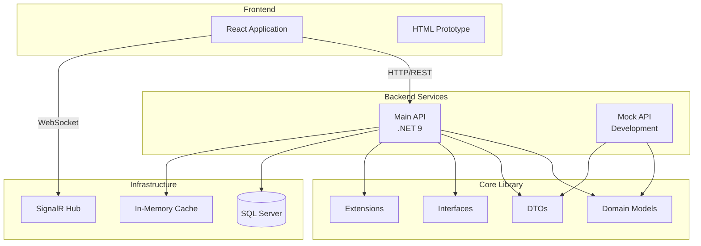

# Central Command Architecture Documentation

## Table of Contents
1. [Overview](#overview)
2. [System Architecture](#system-architecture)
3. [Project Structure](#project-structure)
4. [Core Design Patterns](#core-design-patterns)
5. [Data Flow](#data-flow)
6. [Technology Stack](#technology-stack)
7. [Key Decisions](#key-decisions)

## Overview

Central Command is an enterprise portal management system designed to monitor and manage multiple service portals, track incidents, and provide real-time metrics and analytics. The system follows clean architecture principles with a strong emphasis on domain-driven design, type safety, and maintainability.

## System Architecture



## Project Structure

### Monorepo Organization

```
CentralCommand/
├── apps/                           # Application projects
│   └── api/
│       ├── CentralCommand.Api/    # Main API application
│       │   ├── Application/       # CQRS implementation
│       │   │   ├── Commands/      # Command handlers
│       │   │   ├── Queries/       # Query handlers
│       │   │   └── Validators/    # FluentValidation validators
│       │   ├── Controllers/       # REST API controllers
│       │   ├── Infrastructure/    # Infrastructure concerns
│       │   │   ├── Data/          # EF Core DbContext
│       │   │   ├── Services/      # Service implementations
│       │   │   ├── Middleware/    # Custom middleware
│       │   │   └── BackgroundServices/
│       │   ├── Repositories/      # Repository implementations
│       │   └── Services/          # Business services
│       └── CentralCommand.MockApi/
│
├── libs/                           # Shared libraries
│   └── CentralCommand.Core/       # Core domain library
│       ├── Domain/                # Domain layer
│       │   ├── Entities/         # Domain entities
│       │   ├── Enums/           # Domain enums
│       │   └── ValueObjects/    # Value objects
│       ├── DTOs/                 # Data Transfer Objects
│       │   ├── Common/          # Shared DTOs
│       │   ├── Requests/        # Request DTOs
│       │   └── Responses/       # Response DTOs
│       ├── Extensions/          # Extension methods
│       │   └── MappingExtensions.cs
│       └── Interfaces/          # Contract definitions
│           ├── Repositories/    # Repository interfaces
│           └── Services/        # Service interfaces
│
├── central-command-react/         # React frontend
└── docs/                         # Documentation
    └── SOFTWARE-DESIGN-STANDARDS.md
```

## Core Design Patterns

### 1. Clean Architecture
The solution follows clean architecture principles with clear separation of concerns:

- **Domain Layer** (Core): Contains business logic and entities
- **Application Layer**: Contains use cases and orchestration
- **Infrastructure Layer**: Contains external concerns
- **Presentation Layer**: Controllers and API endpoints

### 2. CQRS (Command Query Responsibility Segregation)
Commands and queries are separated for better scalability and maintainability:

```csharp
// Command
public record CreatePortalCommand : IRequest<PortalResponse>
{
    public string Name { get; init; }
    public string Url { get; init; }
    // ...
}

// Query
public record GetPortalByIdQuery : IRequest<PortalResponse>
{
    public Guid Id { get; init; }
}
```

### 3. Repository Pattern
Abstracts data access with domain-specific repositories:

```csharp
public interface IPortalRepository : IRepository<Portal>
{
    Task<Portal?> GetByIdWithDetailsAsync(Guid id);
    Task<PagedResult<Portal>> GetPagedAsync(PortalQuery query);
}
```

### 4. Extension Methods for Mapping
Instead of AutoMapper, we use simple extension methods:

```csharp
public static class MappingExtensions
{
    public static PortalResponse ToResponse(this Portal portal) { }
    public static Portal ToEntity(this CreatePortalRequest request) { }
    public static void UpdateFrom(this Portal portal, UpdatePortalRequest request) { }
}
```

### 5. Value Objects
Encapsulate related data with validation:

```csharp
public record PortalMetrics
{
    public double ResponseTime { get; init; }
    public double Uptime { get; init; }
    public double ErrorRate { get; init; }
    // ...
}
```

### 6. Domain-Driven Design
Rich domain models with business logic:

```csharp
public class Portal
{
    private string _tags = string.Empty;

    public List<string> GetTags() =>
        string.IsNullOrWhiteSpace(_tags)
            ? new List<string>()
            : _tags.Split(',').ToList();

    public void SetTags(List<string> tags) =>
        _tags = string.Join(",", tags ?? new List<string>());
}
```

## Data Flow

### 1. Request Processing
```
Client Request → Controller → MediatR → Handler → Repository → Database
                                ↓
                           Validator
```

### 2. Response Flow
```
Database → Repository → Handler → Extension Methods → Response DTO → Client
```

### 3. Real-time Updates
```
Background Service → Metrics Collection → SignalR Hub → Connected Clients
```

## Technology Stack

### Backend
- **.NET 9**: Latest framework with performance improvements
- **ASP.NET Core**: Web API framework
- **Entity Framework Core**: ORM for data access
- **MediatR**: CQRS implementation
- **FluentValidation**: Input validation
- **Serilog**: Structured logging
- **SignalR**: Real-time communication
- **JWT**: Authentication

### Frontend
- **React 19**: UI framework
- **TypeScript**: Type safety
- **Vite**: Build tooling
- **Zustand**: State management
- **TanStack Query**: Server state management
- **Tailwind CSS**: Styling
- **Playwright**: E2E testing

### Infrastructure
- **SQL Server**: Primary database
- **In-Memory Cache**: Performance optimization
- **Docker**: Container support (planned)

## Key Decisions

### 1. No AutoMapper
**Decision**: Use extension methods instead of AutoMapper
**Rationale**:
- Simpler code without reflection overhead
- Better performance
- Easier debugging
- Compile-time type safety

### 2. Monorepo Structure
**Decision**: Single repository for all projects
**Rationale**:
- Easier dependency management
- Atomic commits across projects
- Simplified CI/CD
- Better code sharing

### 3. Core Library Pattern
**Decision**: All shared types in CentralCommand.Core
**Rationale**:
- Single source of truth
- No duplicate type definitions
- Clear dependency hierarchy
- Enforces clean architecture

### 4. Rich Domain Models
**Decision**: Business logic in entities, not anemic models
**Rationale**:
- Encapsulation of business rules
- Better maintainability
- Follows DDD principles
- Reduced service layer complexity

### 5. CQRS with MediatR
**Decision**: Separate commands and queries
**Rationale**:
- Clear separation of concerns
- Easier testing
- Better scalability
- Pipeline behaviors for cross-cutting concerns

### 6. Value Objects for Complex Types
**Decision**: Use value objects for grouped data
**Rationale**:
- Immutability
- Validation at boundaries
- Better domain modeling
- Reduced primitive obsession

## API Design

### RESTful Endpoints
```
GET    /api/v1/portals              # List portals
GET    /api/v1/portals/{id}         # Get specific portal
POST   /api/v1/portals              # Create portal
PUT    /api/v1/portals/{id}         # Update portal
DELETE /api/v1/portals/{id}         # Delete portal

GET    /api/v1/incidents            # List incidents
POST   /api/v1/incidents            # Create incident
PUT    /api/v1/incidents/{id}       # Update incident
POST   /api/v1/incidents/{id}/comments # Add comment

GET    /api/v1/statistics           # System statistics
GET    /api/v1/statistics/sparklines # Time-series data
```

### SignalR Hubs
```
/hubs/metrics                       # Real-time metrics updates
/hubs/notifications                 # System notifications
```

## Security

### Authentication
- JWT bearer tokens for API authentication
- API keys for service-to-service communication
- Role-based authorization

### Data Protection
- HTTPS enforcement
- Input validation at all boundaries
- SQL injection prevention via parameterized queries
- XSS protection through proper encoding

## Performance Considerations

### Caching Strategy
- In-memory caching for frequently accessed data
- Cache invalidation on updates
- Distributed cache support (future)

### Database Optimization
- Indexed queries
- Async operations
- Connection pooling
- Lazy loading where appropriate

### API Performance
- Response compression
- Pagination for large datasets
- Projection queries to reduce data transfer
- Background processing for long-running tasks

## Deployment

### Development
```bash
# API
cd backend/src/CentralCommand.Api
dotnet run

# Frontend
cd central-command-react
npm run dev
```

### Production
- Docker containers (planned)
- Health checks for monitoring
- Graceful shutdown handling
- Configuration via environment variables

## Future Enhancements

1. **Microservices Architecture**: Split into smaller services as needed
2. **Event Sourcing**: For audit trail requirements
3. **GraphQL API**: Alternative to REST for flexible queries
4. **Kubernetes Deployment**: For container orchestration
5. **Distributed Caching**: Redis for multi-instance deployments
6. **Message Queue Integration**: For async processing
7. **API Gateway**: For routing and rate limiting

## References

- [Software Design Standards](./docs/SOFTWARE-DESIGN-STANDARDS.md)
- [API Design Document](./API-Design-Document.md)
- [CLAUDE.md](./CLAUDE.md) - Development guidelines