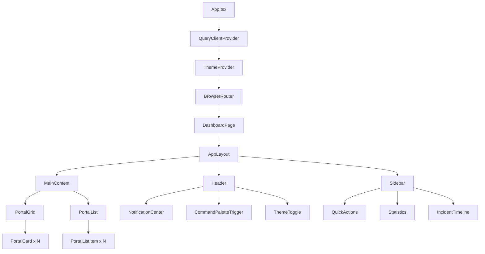

# Central Command React - Architecture Documentation

## Overview

The Central Command React application is a modern portal management dashboard built with React 19, TypeScript, and Vite. It provides real-time monitoring, management, and analytics for enterprise service portals.

## Technology Stack

### Core Technologies
- **React 19.0.0** - UI framework
- **TypeScript 5.7.2** - Type safety and developer experience
- **Vite 5.4.11** - Build tool and dev server
- **Tailwind CSS 4.1.13** - Utility-first CSS framework

### State Management
- **Zustand 5.0.8** - Lightweight state management
- **React Query 5.87.4** - Server state management and caching

### UI Components
- **Radix UI** - Unstyled, accessible component primitives
- **Lucide React** - Icon library
- **Sonner** - Toast notifications
- **cmdk** - Command palette interface

## Project Structure

```
central-command-react/
├── src/
│   ├── components/          # React components
│   │   ├── command-palette/  # Command palette feature
│   │   ├── incidents/        # Incident management
│   │   ├── layout/           # Layout components
│   │   ├── notifications/    # Notification system
│   │   ├── portals/          # Portal management
│   │   ├── providers/        # Context providers
│   │   └── ui/              # Reusable UI components
│   ├── hooks/               # Custom React hooks
│   ├── lib/                 # Utility functions
│   ├── pages/               # Page components
│   ├── stores/              # Zustand stores
│   ├── types/               # TypeScript definitions
│   ├── App.tsx              # Root component
│   └── main.tsx             # Entry point
├── public/                  # Static assets
└── config files            # Configuration

Total: 86 TypeScript/React files
Total Lines: 18,698
```

## Component Hierarchy



## Data Flow Architecture

### 1. State Management Layers

```
┌─────────────────────────────────────────┐
│           Component Layer               │
│  (React Components with local state)    │
└────────────────┬────────────────────────┘
                 │
┌────────────────▼────────────────────────┐
│           Hook Layer                    │
│  (Custom hooks for business logic)      │
└────────────────┬────────────────────────┘
                 │
┌────────────────▼────────────────────────┐
│        Global State Layer               │
│  (Zustand stores for app state)         │
└────────────────┬────────────────────────┘
                 │
┌────────────────▼────────────────────────┐
│        Server State Layer               │
│  (React Query for API data)             │
└─────────────────────────────────────────┘
```

### 2. Store Architecture

#### Portal Store (`usePortalStore`)
- **Purpose**: Manages portal entities and operations
- **State**:
  - `portals[]` - Array of portal objects
  - `filter` - Active filters
  - `selectedPortals[]` - Multi-select state
- **Computed**:
  - `filteredPortals` - Filtered portal list
  - `portalStats` - Aggregated statistics
- **Actions**:
  - CRUD operations
  - Bulk operations
  - Real-time metric updates

#### UI Store (`useUIStore`)
- **Purpose**: UI state and preferences
- **State**:
  - `viewMode` - Grid/List view
  - `sidebarOpen` - Sidebar visibility
  - `commandPaletteOpen` - Command palette state
  - `preferences` - User preferences
  - `notifications[]` - Active notifications

#### Incident Store (`useIncidentStore`)
- **Purpose**: Incident management
- **State**:
  - `incidents[]` - Incident records
  - `activeIncident` - Current incident being viewed
  - `incidentFilters` - Active filters

#### Stats Store (`useStatsStore`)
- **Purpose**: Analytics and metrics
- **State**:
  - `systemStats` - System-wide metrics
  - `portalMetrics` - Individual portal metrics
  - `benchmarks[]` - Performance benchmarks
  - `historicalData` - Time-series data

## Component Design Patterns

### 1. Compound Component Pattern
Used in complex UI components like dropdowns and modals:

```typescript
<DropdownMenu>
  <DropdownMenuTrigger />
  <DropdownMenuContent>
    <DropdownMenuItem />
  </DropdownMenuContent>
</DropdownMenu>
```

### 2. Provider Pattern
Used for global state and theme management:

```typescript
<ThemeProvider>
  <NotificationProvider>
    <CommandPaletteProvider>
      {children}
    </CommandPaletteProvider>
  </NotificationProvider>
</ThemeProvider>
```

### 3. Custom Hook Pattern
Business logic abstraction:

```typescript
function usePortalOperations() {
  const store = usePortalStore();
  const queryClient = useQueryClient();

  return {
    createPortal: async (data) => { /* ... */ },
    updatePortal: async (id, data) => { /* ... */ },
    deletePortal: async (id) => { /* ... */ }
  };
}
```

## Type System Architecture

### Core Type Definitions

```typescript
// Portal Entity
interface Portal {
  id: string;
  name: string;
  url: string;
  status: PortalStatus;
  category: PortalCategory;
  metrics: PortalMetrics;
  // ... 20+ more properties
}

// Metric Types
interface PortalMetrics {
  responseTime: number;
  uptime: number;
  cpu: number;
  memory: number;
  requests: number;
  errors: number;
}

// Enums for Type Safety
enum PortalStatus {
  OPERATIONAL = 'operational',
  DEGRADED = 'degraded',
  MAINTENANCE = 'maintenance',
  OUTAGE = 'outage'
}
```

## Design Decisions & Trade-offs

### 1. Zustand vs Redux
**Decision**: Zustand for state management
**Rationale**:
- Simpler API with less boilerplate
- Better TypeScript support
- Smaller bundle size (8KB vs 60KB)
**Trade-off**: Less ecosystem support and middleware options

### 2. Radix UI vs Material UI
**Decision**: Radix UI for component primitives
**Rationale**:
- Unstyled components allow custom design
- Better accessibility out of the box
- Smaller bundle size when using select components
**Trade-off**: More initial setup work required

### 3. Client-side vs Server-side Rendering
**Decision**: Client-side rendering with Vite
**Rationale**:
- Simpler deployment
- Better suited for dashboard applications
- Faster development iteration
**Trade-off**: Larger initial bundle, no SEO benefits

### 4. TypeScript Strict Mode
**Decision**: Enabled strict mode
**Rationale**:
- Catches more errors at compile time
- Better code quality
- Improved refactoring safety
**Trade-off**: More verbose code, steeper learning curve

## Performance Architecture

### Optimization Strategies

1. **Code Splitting**
   - Route-based splitting
   - Component lazy loading
   - Dynamic imports for heavy features

2. **State Management**
   - Selective subscriptions with Zustand
   - React Query for server state caching
   - Computed properties for derived state

3. **Rendering Optimizations**
   - React.memo for expensive components
   - useMemo/useCallback for expensive computations
   - Virtual scrolling for large lists

4. **Bundle Optimization**
   - Tree shaking with ES modules
   - Chunk splitting for vendor code
   - Asset optimization with Vite

## Security Architecture

### Security Layers

1. **Input Validation**
   - Zod schemas for runtime validation
   - Type checking with TypeScript
   - Sanitization of user inputs

2. **Authentication**
   - Support for multiple auth types (OAuth, SAML, API Key)
   - Token management in memory (not localStorage)
   - Automatic token refresh

3. **Data Protection**
   - HTTPS enforcement
   - Content Security Policy headers
   - XSS protection through React's default escaping

## Deployment Architecture

### Build Pipeline

```
Source Code → TypeScript Compilation → Vite Build → Bundle Optimization → Static Assets
```

### Deployment Targets

1. **Static Hosting** (Recommended)
   - Netlify, Vercel, AWS S3 + CloudFront
   - Simple deployment process
   - Global CDN distribution

2. **Container Deployment**
   - Docker container with nginx
   - Kubernetes deployment
   - Better for enterprise environments

## Scalability Considerations

### Current Limitations

1. **Data Volume**: Can handle ~1000 portals efficiently
2. **Real-time Updates**: Simulated with polling (30s intervals)
3. **Concurrent Users**: Client-side only, no user limits
4. **Memory Usage**: Increases with long sessions

### Scaling Strategies

1. **Horizontal Scaling**
   - CDN for static assets
   - Load balancing for API endpoints
   - Database replication for read scaling

2. **Vertical Scaling**
   - Virtual scrolling for large datasets
   - Pagination for list views
   - Lazy loading of data

3. **Performance Scaling**
   - Web Workers for heavy computations
   - Service Workers for offline support
   - IndexedDB for local data caching

## Migration Path from Original HTML

### Feature Comparison

| Feature | Original HTML | React Version | Status |
|---------|--------------|---------------|--------|
| Portal Grid View | ✅ | ✅ | Complete |
| Portal List View | ✅ | ✅ | Complete |
| Real-time Updates | ✅ | ✅ | Complete |
| Command Palette | ✅ | ✅ | Complete |
| Incident Management | ✅ | ✅ | Complete |
| Theme Toggle | ✅ | ✅ | Complete |
| Notifications | ✅ | ✅ | Complete |
| Portal Filters | ✅ | ✅ | Complete |
| Bulk Operations | ✅ | ⚠️ | Partial |
| Export Functionality | ✅ | ❌ | Missing |
| Charts/Analytics | ✅ | ❌ | Missing |

### Migration Benefits

1. **Maintainability**: Component-based architecture
2. **Type Safety**: Full TypeScript coverage
3. **Testing**: Easier to test individual components
4. **Performance**: Better rendering optimization
5. **Developer Experience**: Hot module replacement, better tooling

### Migration Challenges

1. **Bundle Size**: React version is larger (500KB vs 100KB)
2. **Complexity**: More files and concepts to understand
3. **Build Process**: Requires build step unlike single HTML
4. **Dependencies**: External dependency management

## Future Architecture Enhancements

### Short-term (1-3 months)
1. Implement missing features from original
2. Add comprehensive testing suite
3. Optimize bundle size
4. Fix TypeScript errors

### Medium-term (3-6 months)
1. Add real backend API integration
2. Implement WebSocket for real-time updates
3. Add user authentication system
4. Implement data persistence layer

### Long-term (6-12 months)
1. Micro-frontend architecture for modules
2. Progressive Web App capabilities
3. Advanced analytics and ML insights
4. Multi-tenant support

## Conclusion

The Central Command React application demonstrates a modern approach to building enterprise dashboards. While it successfully implements most features from the original HTML version, there are opportunities for optimization in bundle size, performance, and code quality. The architecture is well-structured for future enhancements and scaling, with clear separation of concerns and modern development practices.